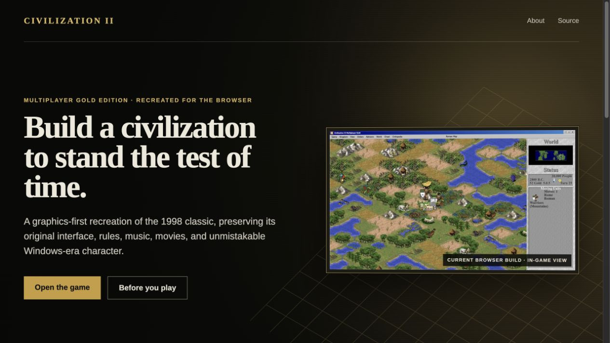
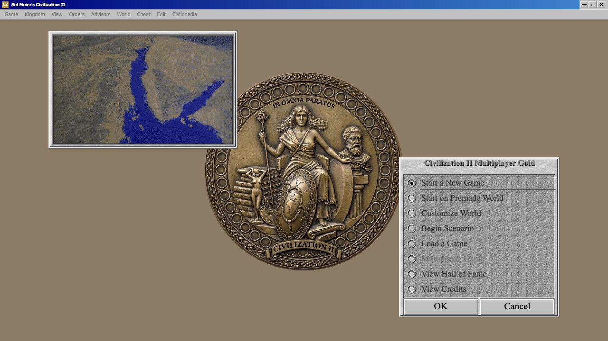

# Civilization II — Browser Recreation

An independent, graphics-first browser recreation of **Sid Meier's
Civilization II Multiplayer Gold Edition**. The project uses Vite, vanilla
JavaScript, Canvas 2D rendering, and optional 2× sprite upscaling while
preserving the original MGE interface, rules, proportions, music, and movies.

> **Ownership requirement:** you must legally own or otherwise be licensed to
> use Civilization II Multiplayer Gold Edition before opening the game. The
> hosted version presents this attestation before any MGE-derived asset loads.

[](https://wan0.net/civ2/)

## Play

Visit the [project site](https://wan0.net/civ2/) and choose **Open the
game**. The project page explains the recreation and the game page records the
ownership attestation locally in your browser.

## Status

- Complete original MGE movie library: 28 Wonders, 21 heralds, opening,
  victory, launch, defeat, anarchy, and High Council movies
- Original city, research, Civilopedia, throne-room, advisor, score, and map UI
- Save/load, scenarios, diplomacy, research, combat, AI, Wonders, spaceship,
  government, trade, and late-game mechanics
- 261 Playwright browser regression tests
- Production build deployable beneath the GitHub Pages `/civ2/` project path

This is a playable public beta, not a claim that every undocumented MGE edge
case has been reproduced.



## Local development

```bash
npm ci
npx playwright install chromium
npm run dev
```

Open `http://localhost:3000/` for the project page or
`http://localhost:3000/game.html` for the game.

Validation:

```bash
npm test          # complete browser suite
npm run build     # root-path production build
npm run build:pages
npm run preview:pages
```

## Reporting bugs

Choose **Game → Report Bug...** inside a running game. The app creates one ZIP
containing a screenshot, a restorable game-state snapshot, the current camera
and open-screen state, and browser/viewport diagnostics.

- **Download ZIP** saves the report locally.
- **Share / Email** uses the browser or operating system share sheet when file
  sharing is supported. Otherwise it downloads the ZIP and opens an email draft
  that tells you which file to attach.
- **GitHub Issue** downloads the same ZIP and opens a prepared issue. Attach the
  downloaded file before submitting it.

The static app never asks for or stores GitHub credentials. Bug-report ZIPs can
contain original MGE artwork, so they should be shared only for diagnosis.

## Repository layout

```text
src/               game engine, renderers, data, audio, and site entry points
public/            browser-ready runtime files only
tests/             Playwright regression suite
tools/             documented extraction and conversion utilities
docs/              parity, provenance, asset, and architecture notes
reference-local/   local original installation; ignored and never published
reference/         local third-party reference checkout; ignored
```

`public/` intentionally excludes the original Windows installation,
executables, DLLs, saves, logs, source AVIs, duplicate sprite extractions, and
development comparison files. See [ASSET-NOTICE.md](ASSET-NOTICE.md).

## Reference and provenance

The primary behavioral reference is
[axx0/Civ2-clone](https://github.com/axx0/Civ2-clone), a GPL-3.0 C# project.
It is used to understand observable MGE behavior, data, sprite coordinates,
and file formats; its source is not included in this repository and this
project's JavaScript implementation is independently written.

The running original Civilization II MGE game is authoritative when behavior
or presentation differs. See [docs/reference-data.md](docs/reference-data.md)
and [docs/image-assets.md](docs/image-assets.md).

## Licence

Original project code and documentation are licensed under the
[BSD 3-Clause Licence](LICENSE). That licence does **not** apply to original
Civilization II assets, trademarks, or other third-party material. See
[ASSET-NOTICE.md](ASSET-NOTICE.md) for the ownership boundary and disclaimer.

This project is not affiliated with, endorsed by, or sponsored by MicroProse,
2K Games, Take-Two Interactive, or the original game's creators.
